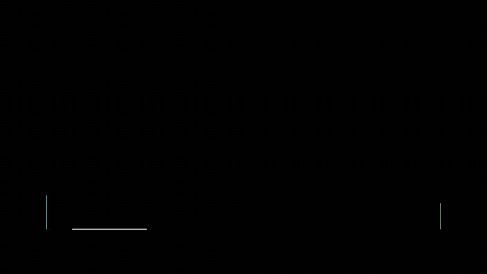
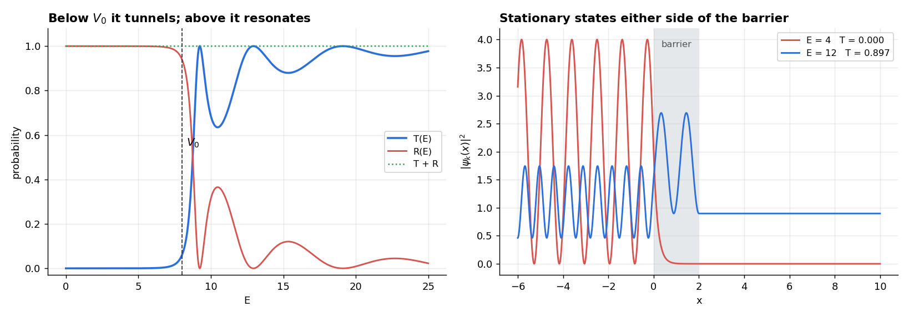
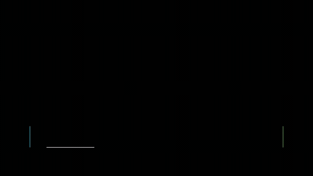
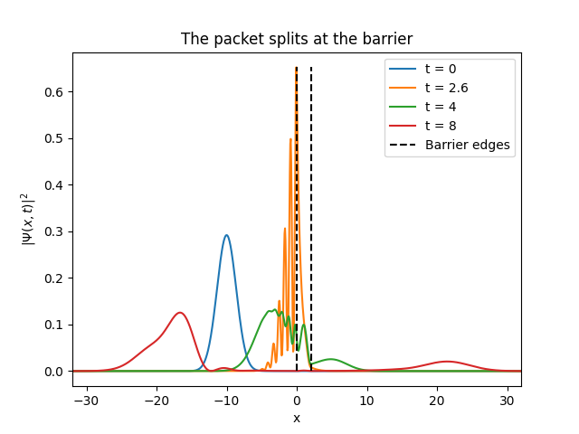
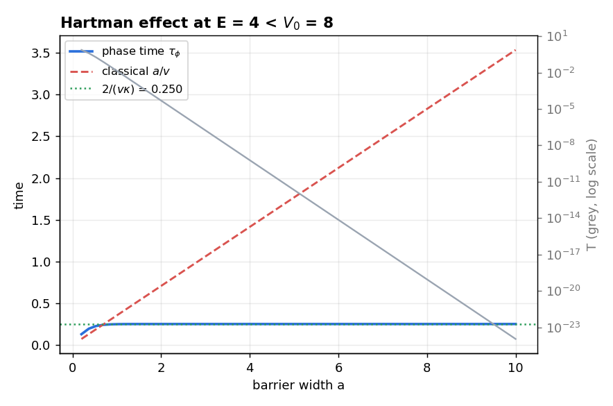

# Gaussian Wave Packet Meeting a Potential Barrier

**A quantum particle does not arrive at a wall and bounce — it splits.** This project solves the rectangular-barrier scattering problem analytically, builds a Gaussian wave packet as a superposition of those eigenstates, integrates it in time, and animates the result. Then it checks the physics: unitarity, boundary conditions, probability conservation, and whether the packet actually transmits the fraction the theory says it should.



> Project for *Analysis of quantum systems* (Tec de Monterrey, Ingeniería Física Industrial, October 2025) by **Hector Campbell Salas**, Alfredo Almaguer and Espartaco Alvarado. Report (Spanish) in [`docs/`](docs); the full set of animations is [on YouTube](https://youtu.be/Hj0fnbVcIyE).
>
> The animation above is the case the video labels *T(⟨E⟩) = 0.00*. The packet still gets through — [see below](#the-mean-energy-is-the-wrong-number-to-quote).

## The physics

The potential is a rectangle of height $V_0$ and width $a$. A plane wave of unit amplitude comes in from the left:

```math
\psi_k(x) = \begin{cases}
e^{ikx} + B\,e^{-ikx} & x < 0\\
C\,e^{iqx} + D\,e^{-iqx} & 0 \le x \le a,\quad E > V_0,\; q = \sqrt{2m(E-V_0)}/\hbar\\
C\,e^{\kappa x} + D\,e^{-\kappa x} & 0 \le x \le a,\quad E < V_0,\; \kappa = \sqrt{2m(V_0-E)}/\hbar\\
F\,e^{ikx} & x > a
\end{cases}
```

Matching $\psi$ and $\psi'$ at both edges fixes B, C, D and F, and gives the transmission coefficient in closed form:

```math
T = \left[1 + \frac{(k^2+\kappa^2)^2}{4k^2\kappa^2}\sinh^2(\kappa a)\right]^{-1} \; (E<V_0),
\qquad
T = \left[1 + \frac{(k^2-q^2)^2}{4k^2q^2}\sin^2(q a)\right]^{-1} \; (E>V_0)
```



Below the barrier the wave decays exponentially inside it and leaks out with small amplitude. Above it, transmission is *not* one: the two edges act like a Fabry–Pérot cavity, so T oscillates and reaches 1 exactly at the resonances $qa = n\pi$. A packet with mean energy well above the barrier still leaves a reflected lobe behind:



**The packet.** A localized state is a superposition over k, propagated with each component's own phase:

```math
\Psi(x,t) = \frac{1}{\sqrt{2\pi}}\int \phi(k)\,\psi_k(x)\,e^{-i\hbar k^2 t/2m}\,dk,
\qquad
\phi(k) = \left(\tfrac{2b}{\pi}\right)^{1/4}\frac{e^{ix_0(l-k)}}{\sqrt{2b}}\,e^{-(l-k)^2/4b}
```

The interesting step is choosing the packet's width. Rather than picking $b$ and $l$ by hand, the report inverts the moments — $\langle E\rangle = (l^2+b)/2$ and $\sigma_E^2 = 2\langle E\rangle b - b^2/2$ — so the simulation is parameterized by a **requested mean energy and energy variance**:

```math
b = \frac{m}{\hbar^2}\left(2\langle E\rangle - \sqrt{4\langle E\rangle^2 - 2\sigma_E^2}\right),
\qquad l = \sqrt{\frac{2m\langle E\rangle}{\hbar^2} - b}
```

The integral is then evaluated as a Riemann sum over 10,000 values of k, and Manim renders |Ψ(x,t)|² against the barrier profile.

## Does it hold up?

[`src/checks.py`](src/checks.py) re-derives every claim and compares it against an independent route. All of it runs in about two seconds.

| Check | Result |
|---|---|
| Unitarity, T(E) + R(E) = 1, over 20,000 energies | max error **1.0 × 10⁻¹⁵** |
| Closed-form T vs \|F\|² from the matched coefficients | max difference **1.3 × 10⁻¹⁵** |
| ψ and ψ′ continuous at x = 0 and x = a (evaluated analytically from both sides) | ≤ **1 × 10⁻¹⁵** |
| Analytic b, l reproduce the requested ⟨E⟩ = 7.5, σ²_E = 2 | **7.500000 / 2.000000** |
| ∫\|Ψ(x,t)\|² dx over the whole propagation | **1 ± 3 × 10⁻⁵** |
| Wigner phase time vs the known thick-barrier limit 2/(vκ) | agrees to **0.00 %** |

The strongest test is not in that table, because it ties the two halves of the project together.



**Propagate the packet, then integrate.** Run Ψ(x,t) forward until the reflected and transmitted lobes have fully separated, integrate |Ψ|² over x > a, and compare with what the stationary theory predicts — the T-weighted average over the packet's own spectrum, $\langle T\rangle_\phi = \int |\phi(k)|^2 T(E_k) dk / \int |\phi(k)|^2 dk$:

| | |
|---|---|
| Propagated packet, x > a at t = 16 | **0.184755** |
| Spectral prediction ⟨T⟩_φ | **0.184774** |
| Relative difference | **1.0 × 10⁻⁴** |

Five significant figures, from two completely different calculations. That is the check that says the eigenfunctions, the coefficients, the packet construction and the time integration are all mutually consistent.

### The mean energy is the wrong number to quote

The animations print **T(⟨E⟩)** on screen, and for the default case (⟨E⟩ = 7.5 against V₀ = 8) that number is **0.0175**. The packet actually transmits **0.1848** — **ten and a half times more**.

The reason is that transmission is wildly non-linear in energy, so the average of T is nothing like T of the average. Only 34.6 % of the packet's spectral weight sits above the barrier, but **96.3 % of everything that gets through comes from that tail**. The sub-barrier components — the ones people mean when they say "tunneling" — contribute under 4 % of the transmitted probability here. A packet is not a particle with one energy, and the headline number in the video understates what the animation itself shows.

### The Hartman effect

The last animations in the video vary the barrier width to look for the Hartman effect: the tunneling delay stops growing once the barrier is thick. The report notes, honestly, that it is hard to *see* — as the barrier widens the transmitted packet becomes too faint to follow. The phase time makes it quantitative instead.



For E = 4 below V₀ = 8, the Wigner phase time $\tau_\phi = \hbar \, d(\arg t)/dE$ saturates at **0.2500** — exactly the analytic limit 2/(vκ) — while the classical traversal time a/v grows without bound. Meanwhile T falls from 1.4 × 10⁻² at a = 1 to 1.1 × 10⁻²⁴ at a = 10, which is precisely why the effect is invisible on screen: **the delay stops growing and the amplitude collapses at the same time.**

Dividing width by delay gives an "apparent velocity" that grows without limit, which is what made the effect notorious. The resolution the report follows is Winful's: the saturating quantity is not a transit time at all but a **dwell time** — how long probability lingers in the barrier — plus a self-interference term. Nothing propagates faster than it should; what saturates is the stored probability, which stops growing once the evanescent wave has decayed inside the barrier.

## Honest limitations

- **Rectangular barrier, one dimension, no absorption.** The model is exactly solvable, which is the point, and correspondingly idealized.
- **The Riemann sum is the integrator.** Convergence is controlled by the number of k-points and the width of the window, both set by hand. The checks above pass at 4,000 points; the animation uses 10,000 and costs minutes per render.
- **The k-window in the original Manim scene is set from `1/(2√b)` rather than the correct `σ_k = √b`.** For the parameters used it makes the window *wider* than needed — harmless, just slower — but for a broader packet (b > 1/2) it would truncate the spectrum. [`src/barrier.py`](src/barrier.py) uses √b; the scene is published as it was delivered.
- **Phase time is one of several tunneling times** (dwell, Büttiker–Landauer, Larmor), and which one an experiment measures is the substance of the Hartman debate. The saturation shown here is a property of the transmission phase, not a measured transit.

## Repository

```
src/barrier.py             scattering solution, T/R, the packet, phase time
src/checks.py              every verification above + the README figures
src/wave_packet_manim.py   the original Manim scene, as delivered
media/                     animations (GIF)
results/                   numerical outputs of the checks
docs/                      report (Spanish), figures
```

```bash
pip install numpy matplotlib
python src/checks.py        # ~2 s, prints every number in this README

pip install manim           # only for re-rendering the animation
manim -pqh src/wave_packet_manim.py Paqueton
```

## Stack

Python · NumPy · Matplotlib · Manim · LaTeX

## Authors

**Héctor Campbell Salas** · José Alfredo Almaguer Cruz · Espartaco Alvarado González
